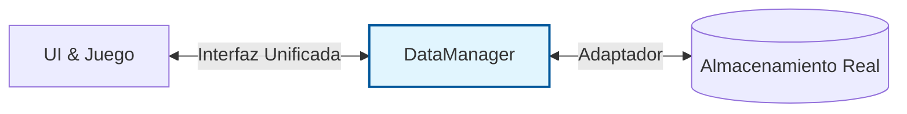

Aquí tienes un documento en Markdown completo y estructurado que resume todo el rol y funcionalidades del `DataManager` según lo hemos diseñado.

Puedes copiar y pegar esto directamente en tu repositorio o documentación del proyecto.

-----

# Documentación Técnica: Game Data Manager

## 1\. Visión General

El **DataManager** es el pilar central de la gestión de estado persistente en el juego. Actúa como la "Fuente Única de Verdad" (Single Source of Truth) para cualquier dato que deba sobrevivir más allá de una sola sesión de juego o entre diferentes escenas.

Su propósito principal es **desacoplar** la lógica del núcleo del juego (GameLoop/Phaser) de la lógica de almacenamiento (cómo y dónde se guardan los datos).

## 2\. Responsabilidades Clave

El DataManager tiene cuatro responsabilidades fundamentales:

### A. Gestión de Configuración (Settings)

  * Mantiene en memoria las preferencias del jugador (volumen de música/SFX, offset de audio, mapeo de teclas).
  * Provee estos datos de forma síncrona e inmediata al juego cuando inicia un nivel.
  * Permite la modificación "en caliente" de estas configuraciones desde el menú de pausa.

### B. Persistencia de Datos (Saving/Loading)

  * Abstrae la capa de almacenamiento. El resto del juego no sabe si los datos vienen de `localStorage`, MongoDB o Firebase.
  * Maneja el guardado asíncrono (en segundo plano) para no bloquear la interfaz de usuario al terminar una partida.

### C. Gestión de Sesión y Perfil

  * Almacena temporalmente los datos básicos del usuario autenticado (ID, username, tokens de sesión).
  * Mantiene el historial local de puntuaciones recientes antes de confirmarlas en el servidor.

### D. Inicialización del Estado

  * Es el primer sistema en cargar al arrancar la aplicación. Garantiza que cuando el juego llegue al menú principal, ya tenga todos los datos necesarios listos en memoria.

-----

## 3\. Arquitectura

  * **Patrón de Diseño:** Singleton. Solo debe existir una instancia del `DataManager` activa durante todo el ciclo de vida de la aplicación.
  * **Ubicación en el Flujo:** Intermediario entre la capa de Presentación/Juego (UI HTML, Phaser) y la capa de Infraestructura (API REST, Base de Datos local).

<!-- end list -->



-----

## 4\. Contrato de Interfaz (`IGameDataManager`)

Cualquier implementación del gestor de datos debe cumplir con este contrato para asegurar que el juego funcione sin cambios si cambiamos el backend.

```typescript
export interface IGameDataManager {
    // --- CICLO DE VIDA ---
    init(): Promise<void>;

    // --- CONFIGURACIÓN ---
    getSettings(): GameSettings;
    updateSettings(changes: Partial<GameSettings>): void;

    // --- USUARIO Y PROGRESO ---
    getUserProfile(): UserProfile | null;
    saveLevelResult(levelId: string, result: LevelResult): Promise<void>;
    getLocalHighScores(levelId: string): LevelResult[];
}
```

### Estructuras de Datos Clave

```typescript
// Configuración que el juego necesita para funcionar
interface GameSettings {
    audioOffset: number;    // Milisegundos (ej. -15)
    volumeMusic: number;    // 0.0 a 1.0
    volumeSfx: number;      // 0.0 a 1.0
    inputMap: Record<string, string>; // ej. { 'HIT_RED': 'KeyZ' }
}

// Resultado de una partida
interface LevelResult {
    score: number;
    maxCombo: number;
    perfects: number;
    misses: number;
    timestamp: string; // ISO Date
}
```

-----

## 5\. Flujos de Operación Principales

### Flujo 1: Arranque de la Aplicación

1.  La App Web se abre.
2.  Se instancia `DataManager`.
3.  Se llama a `DataManager.init()`.
      * *Intenta cargar desde `localStorage` para inicio rápido.*
      * *Si hay token de sesión, intenta conectar con API para actualizar datos.*
4.  La App muestra el Menú Principal solo cuando `init()` termina.

### Flujo 2: Jugar un Nivel

1.  El usuario selecciona un nivel.
2.  El juego solicita `DataManager.getSettings()` e inyecta la configuración en el motor de audio y controles.
3.  El usuario juega (el DataManager no hace nada aquí, latencia cero).
4.  Termina la canción.
5.  El juego envía los resultados a `DataManager.saveLevelResult(resultados)`.
6.  El DataManager guarda en memoria local inmediatamente y lanza el proceso de guardado en servidor en segundo plano.

-----

## 6\. Estrategia de Evolución (Roadmap)

El diseño del DataManager permite un desarrollo iterativo:

| Fase | Almacenamiento | Características | Estado |
| :--- | :--- | :--- | :--- |
| **v1 (Prototipo)** | `localStorage` (Navegador) | Funciona offline. Los datos se pierden si borra caché. Ideal para desarrollo rápido del gameplay core. | ✅ Listo para dev |
| **v2 (Producción)** | API REST + MongoDB | Persistencia real en la nube. Requiere login. Sincroniza progreso entre dispositivos. | 📅 Planificado |

> **Nota:** El cambio de v1 a v2 solo requiere modificar el código interno de los métodos `init` y `saveLevelResult` dentro del `DataManager`. El resto del juego no necesitará ninguna modificación.
